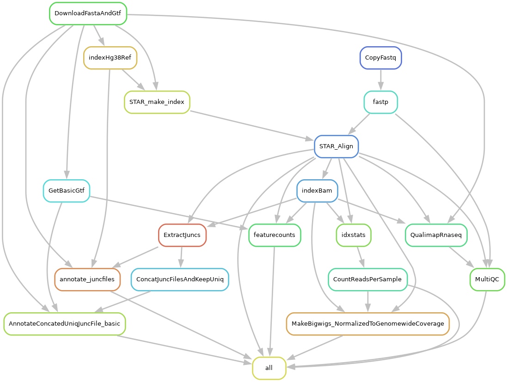

# what is this workflow 

This workflow the one I did before going to Florida 
These samples were all polyA 

# Snakemake workflow: RNA-seq_SimpleQuantification

## Authors

* Benjamin Fair (@bfairkun)

## Summary

### Description
This workflow contains rules to download genome files, index genome and align reads with STAR, perform some basic QC, count splice junction reads (regtools) and gene reads (feature counts). Can handle different samples from different species, as defined in `config/STAR_Genome_List.tsv` and `config/samples.tsv`. Because this is often just the start of a RNA-seq analysis, this workflow might be best used as a module in a Snakemake workflow that further extends this work.

### Dag
Rulegraph dag:

## Usage

### Step 1: Install workflow and dependencies

If you simply want to use this workflow, clone the [latest release](https://github.com/bfairkun/rna-seq_simplequantification).

    git clone git@github.com:bfairkun/rna-seq_simplequantification.git

If you intend to modify and further develop this workflow, fork this repository. Please consider providing any generally applicable modifications via a pull request.

Install snakemake and the workflow's other dependencies via conda/mamba. If conda/mamba isn't already installed, I recommend [installing miniconda](https://docs.conda.io/en/latest/miniconda.html) and then [install mamba](https://github.com/mamba-org/mamba) in your base environment. Then...

    # move to the snakemake's working directory
    cd rna-seq_simplequantification/code
    # Create environment for the snakemake
    mamba env create -f envs/rna-seq_simplequantification.yaml
    # And activate the enviroment
    conda activate rna-seq_simplequantification

### Step 2: Configure workflow

Configure the workflow according to your needs via editing the file `config.yaml`. Use/modify the config yaml files in the `snakemake_profiles/slurm/` profile to run on UChicago RCC Midway with slurm scheduler.

### Step 3: Execute workflow

Test your configuration by performing a dry-run via

    snakemake -n

Execute the workflow locally via

    snakemake --cores $N

using `$N` cores or run it in a cluster environment via the included slurm snakemake profile.

    snakemake --profile /project/yangili1/dylan_stermer/alt_seq_strategy_may2024/snakemake-workflow_rna-seq/snakemake_profiles/slurm_midway3

See the [Snakemake documentation](https://snakemake.readthedocs.io) for further details.

# When you get fastq files you need to make a table with the pathways. Here is close to the code that I used 
# Everytime you use this code you need to change the location of the sample.tsv and the location of where you fastqfiles are located 
echo -e "sample\tSTARGenomeName\tR1\tR2" > /project2/yangili1/dylan_stermer/polyA_riboMinus_sideByside/snakemake_workflow/config/samples.tsv
paste -d'\t' <(ls -1 /project2/yangili1/dylan_stermer/polyA_riboMinus_sideByside/fastq/*_R1_*.fastq.gz | perl -lne '$_ =~ m/^.+?YLi-DS-8s-(.+?)_S.+$/; print "$1\tGRCh38_GencodeRelease44Comprehensive"') <(ls -1 /project2/yangili1/dylan_stermer/polyA_riboMinus_sideByside/fastq/*_R1_*.fastq.gz) <(ls -1 /project2/yangili1/dylan_stermer/polyA_riboMinus_sideByside/fastq/*_R2_*.fastq.gz) >> /project2/yangili1/dylan_stermer/polyA_riboMinus_sideByside/snakemake_workflow/config/samples.tsv

# Create samples.tsv file with header
echo -e "sample\tSTARGenomeName\tR1\tR2" > "$SAMPLES_FILE"

# Generate sample entries and append to samples.tsv
paste -d'\t' <(ls -1 "$FASTQ_DIR"/*_R1_*.fastq.gz | perl -lne '$_ =~ m/^.+?YLi-DS-8s-(.+?)_S.+$/; print "$1\tGRCh38_GencodeRelease44Comprehensive"') \
            <(ls -1 "$FASTQ_DIR"/*_R1_*.fastq.gz) \
            <(ls -1 "$FASTQ_DIR"/*_R2_*.fastq.gz) >> "$SAMPLES_FILE"